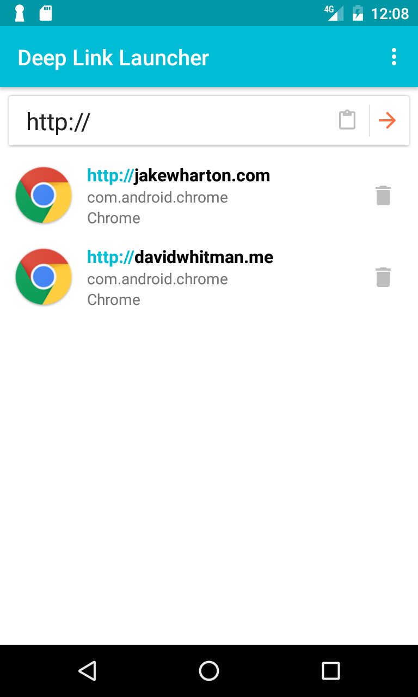

# Deep Link Launcher

This is a small but useful Android app to launch deep links. 

A deep link is a url that can take you to a specific page within a mobile app; for example, directly to somebody's Facebook profile page. 

[See: What is deep linking?](https://branch.io/what-is-deep-linking/)

This app is based off of [Manoj Madanmohan's Deep Link Tester](https://github.com/ManojMadanmohan/dlt).

### Features
- Launches deep links
- Keeps a filterable history locally (done) or online (in progress)
- Shiny.

### Screenshot

Launcher Icon made by <a href="http://www.flaticon.com/authors/dave-gandy" title="Dave Gandy">Dave Gandy</a> from <a href="http://www.flaticon.com" title="Flaticon">www.flaticon.com</a> is licensed by <a href="http://creativecommons.org/licenses/by/3.0/" title="Creative Commons BY 3.0" target="_blank">CC 3.0 BY</a>

