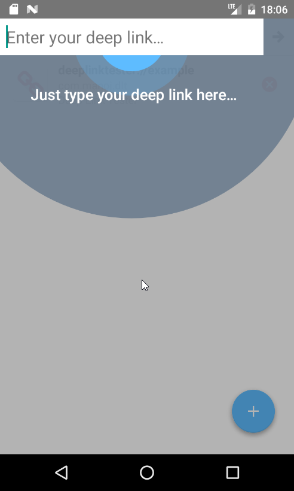

# dlt
This is a small, albeit useful android app to fire and test out deep links. Deep links are useful for app indexing, intercepting corresponding web urls of app, allowing other apps to link into your app, etc.

The tutorial screen pretty much sums up what the app does:

Launcher Icon made by <a href="http://www.flaticon.com/authors/dave-gandy" title="Dave Gandy">Dave Gandy</a> from <a href="http://www.flaticon.com" title="Flaticon">www.flaticon.com</a> is licensed by <a href="http://creativecommons.org/licenses/by/3.0/" title="Creative Commons BY 3.0" target="_blank">CC 3.0 BY</a>

